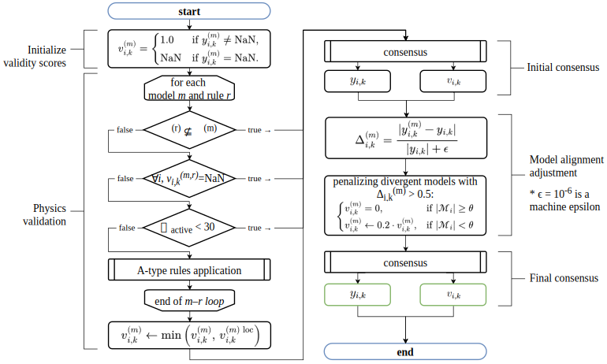
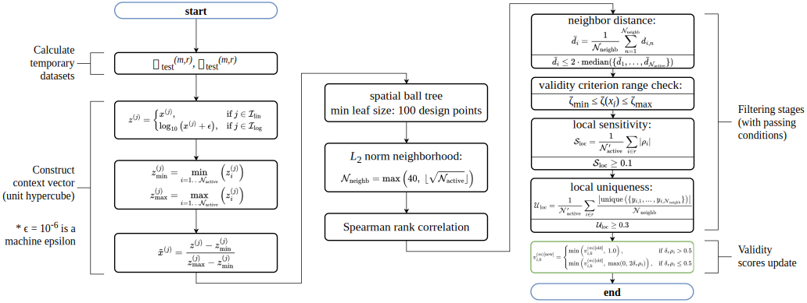
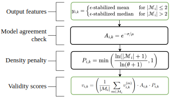
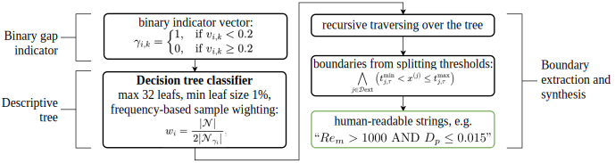
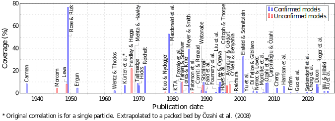
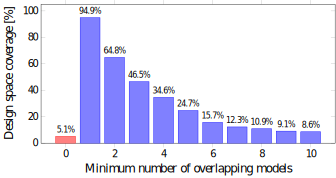
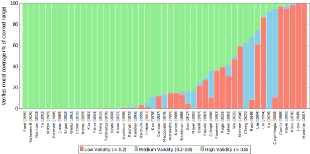
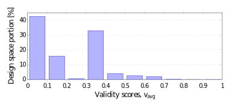

# Cross-Validation Framework for Pressure Drop in Randomly Packed Beds

[](https://doi.org/10.5281/zenodo.20756923)

A computational framework for systematic cross-validation and gap analysis of packed bed correlations. Currently focused on single-phase pressure drop (ΔP) models.

## Overview

Dozens of pressure drop correlations exist for packed beds, each with partially overlapping validity ranges derived from different experimental setups. This framework answers three questions:

1. **Which models are physically reliable?** — Cross-validate each model against fundamental physical laws
2. **Where do models agree?** — Compute a weighted consensus across all models and quantify agreement
3. **Where are the blind spots?** — Detect regions of the design space where no model provides reliable predictions

The pipeline operates in three corresponding stages.

---

## Pipeline

### 1. Dataset Generation

A comprehensive design space is generated using a Sobol sequence (2<sup>18</sup> ≈ 262,144 points) spanning 6 input parameters:

| Parameter                | Symbol        | Range         | Units |
| ------------------------ | ------------- | ------------- | ----- |
| Bed diameter             | $D$           | 0.1 – 5       | m     |
| Bed length               | $L$           | 1·D – 500·D   | m     |
| Particle diameter        | $D_p$         | D/500 – D/1.5 | m     |
| Particle sphericity      | $\phi_s$      | 0.5 – 1       | —     |
| Bed void fraction        | $\varepsilon$ | 0.36 – 0.9    | —     |
| Superficial gas velocity | $U_{s,G,in}$  | 0.01 – 5      | m/s   |

Each source model is evaluated at every design point. Predictions are masked with NaN where the point falls outside the model's validity range. The output is the extended output matrix $\mathcal{Y}_\text{ext}$ (one column per model) and the initial validity matrix $\mathcal{V}_\text{ext}$ (1 = valid, NaN = out of range).

### 2. Cross-Validation

The cross-validation module assesses model reliability through two complementary mechanisms: physics-informed validation and data-driven consensus.

<figure>
  
  <figcaption><i>Cross-validation routine</i></figcaption>
</figure>

#### A-Rules: Physics-Based Tests

Each A-Rule tests whether a model respects a fundamental physical law within its local neighborhood in the design space. For each model and each rule:

1. For each design point, find the $k$ nearest neighbors in the model's input context space using a Ball Tree.
2. Compute the Spearman rank correlation between the rule's transformed input (e.g., viscous stress $\mu U_s/D_p^2$) and output (e.g., $\Delta P/L$) across the neighborhood.
3. Compare the observed correlation direction against the expected physical relationship (positive or negative monotonicity).
4. Assign a validity score (0–1) based on correlation strength; unreliable neighborhoods (too sparse, too uniform) are skipped.

<figure>
  
  <figcaption><i>A-type rule routine</i></figcaption>
</figure>

**Currently implemented A-Rules:**

$$
\frac{\Delta P}{L}\propto \frac{\mu_G\cdot U_s}{ D_p^2} \quad \text{at } Re_m < 1000 \text{ (laminar stress test)};
$$

$$
\frac{\Delta P}{L}\propto \frac{\rho_G\cdot U_s^2}{ D_p} \quad \text{at } Re_m > 10 \text{ (turbulent stress test)}.
$$

#### Weighted Median Consensus

At each design point, a consensus $\Delta P$ is computed as the weighted median of all valid model predictions, weighted by each model's current validity score. The confidence in the consensus accounts for:

- Number of contributing models (density penalty for sparse coverage).
- Agreement among models (coefficient of variation).
- Average validity of contributing models.

<figure>
  
  <figcaption><i>Generalized routine for initial and final consensuses</i></figcaption>
</figure>

#### Model Alignment

After consensus, each model's predictions are compared against the consensus. Models that consistently deviate are penalized or discarded, and the final consensus is recomputed.

### 3. Gap Detection

The gap detection module identifies "blind spots" — regions of the design space where model coverage is insufficient.

1. The final validity scores are converted to a binary coverage map: $v_{i,k}\ge0.2$ → covered.
2. A decision tree classifier is trained to partition the design space into regions of high vs. low coverage.
3. The tree is traversed to extract interpretable rules describing each blind spot region.
4. Coverage statistics are reported: what fraction of the design space is covered at each validity threshold.

<figure>
  
  <figcaption><i>Gap detection routine</i></figcaption>
</figure>

---

## Source Models

49 single-phase pressure drop correlations are implemented (1937–2026), all of semi-empirical type. Each model is implemented with its original validity ranges and friction factor formulation.

| #   | Model                                                                           | Correlation                                                                                                                                                                                                                                                                                                                                                                                                                      | Coverage                                                                                                                                     |
| --- | ------------------------------------------------------------------------------- | -------------------------------------------------------------------------------------------------------------------------------------------------------------------------------------------------------------------------------------------------------------------------------------------------------------------------------------------------------------------------------------------------------------------------------- | -------------------------------------------------------------------------------------------------------------------------------------------- |
| 1   | [Carman (1937)](https://doi.org/10.1016/S0263-8762(97)80003-2)                  | $\frac{\Delta P}{L}=\left(\frac{6\phi_s}{Re_m}+0.4\left(\frac{6\phi_s}{Re_m}\right)^{0.1}\right)\frac{S_1\rho U_s^2}{\varepsilon^3}$ <br>$S_1=\frac{6(1-\varepsilon)}{\phi_s D_p}+\frac{4}{D}$ <br>$Re_1=\frac{Re_p\phi_s}{6(1-\varepsilon)}$                                                                                                                                                                                    | $0.01\le Re_1\le10^4$, $D/D_p\ge2$, $\phi_s\ge0.95$, $0.3\le\varepsilon\le0.9$                                                               |
| 2   | Morcom (1946) [^morcom1946] [^unconfirmed]                                      | $\frac{\Delta P}{L}=\left(\frac{784.8}{Re_p}+13.73\right)\frac{0.405\rho U_s^2}{\varepsilon^3D_p}$                                                                                                                                                                                                                                                                                                                               | $Re_p<750$, $\phi_s\ge0.95$, $D/D_p>5$                                                                                                       |
| 3   | [Rose & Rizk (1949)](https://doi.org/10.1243/PIME_PROC_1949_160_047_02)         | $\frac{\Delta P}{L}=\left(\frac{1000}{Re_p}+\frac{125}{Re_p^{0.5}}+14\right)\frac{f\rho U_s^2}{D_p}$ $f=36\,e^{-0.0915\varepsilon}+0.055$                                                                                                                                                                                                                                                                                        | $100\le Re_p\le10^5$, $D/D_p\ge1$, $\phi_s\ge0.3$, $0.3\le\varepsilon\le0.9$                                                                 |
| 4   | Leva (1949)[^leva1949] [^unconfirmed]                                           | $\frac{\Delta P}{L}=2F_m\frac{\rho U_s^2}{D_p}\frac{(1-\varepsilon)^{3-n}}{\varepsilon^3}$ <br>$n = 1$ for $Re_p < 11.5$,<br> $n = f(\log_{10}(Re_p))$ for $Re_p \ge 11.5$<br>$F_m=10^{f(\log_{10}(Re_p))}$                                                                                                                                                                                                                      | $Re_p<10^4$, $\phi_s\ge0.95$                                                                                                                 |
| 5   | [Ergun (1952)](src/papers/ergun1952.pdf)                                        | $\frac{\Delta P}{L}=\left(\frac{150}{Re_m}+1.75\right)\frac{\rho U_s^2(1-\varepsilon)}{D_p\varepsilon^3}$                                                                                                                                                                                                                                                                                                                        | $1.2\le Re_m\le4200$, $D/D_p>10$, $\phi_s\ge0.95$                                                                                            |
| 6   | [Wentz & Thodos (1963)](https://doi.org/10.1002/aic.690090118)                  | $\frac{\Delta P}{L}=\frac{A}{Re_m^{0.05}-1.2}\frac{\rho U_s^2(1-\varepsilon)}{D_p\varepsilon^3}$ $A=0.396-0.045\,e^{-0.47(L/D_p-5)}$                                                                                                                                                                                                                                                                                             | $2550<Re_m<6.49\times10^4$, $L/D_p\ge5$, $D/D_p\ge11$, $\phi_s\ge0.95$, $0.354<\varepsilon<0.882$                                            |
| 7   | [Kürten et al. (1966)](https://doi.org/10.1002/cite.330380905)                  | $\frac{\Delta P}{L}=\frac{25c_w\rho U_s^2(1-\varepsilon)^2}{4D_p\varepsilon^3}$ $c_w=\frac{21}{Re_p}+\frac{6}{Re_p^{0.5}}+0.28$                                                                                                                                                                                                                                                                                                  | $0.1\le Re_p\le4000$, $\phi_s\ge0.95$                                                                                                        |
| 8   | Handley & Heggs (1968)[^handley1968] [^unconfirmed]                             | $\frac{\Delta P}{L}=\left(\frac{368}{Re_m}+1.24\right)\frac{\rho U_s^2(1-\varepsilon)}{D_p\varepsilon^3}$                                                                                                                                                                                                                                                                                                                        | $200<Re_p<1.3\times10^4$, $\phi_s\ge0.8$                                                                                                     |
| 9   | [Mehta & Hawley (1969)](https://doi.org/10.1021/i260030a021)                    | $\frac{\Delta P}{L}=\left(\frac{150M^2}{Re_m}+1.75M\right)\frac{\rho U_s^2(1-\varepsilon)}{D_p\varepsilon^3}$ $M=1+\frac{2D_p}{3D(1-\varepsilon)}$                                                                                                                                                                                                                                                                               | $Re_m/M\le10$, $D/D_p\ge7$, $\phi_s\ge0.95$                                                                                                  |
| 10  | [Hicks (1970)](https://doi.org/10.1021/i160035a032)                             | $\frac{\Delta P}{L}=6.8\,Re_m^{1.2}\frac{\rho U_s^2(1-\varepsilon)}{D_p\varepsilon^3}$                                                                                                                                                                                                                                                                                                                                           | $300<Re_m<6\times10^4$, $\phi_s\ge0.95$                                                                                                      |
| 11  | [Tallmadge (1970)](https://doi.org/10.1002/aic.690160639)                       | $\frac{\Delta P}{L}=\left(\frac{150}{Re_m}+\frac{4.2}{Re_m^{1/6}}\right)\frac{\rho U_s^2(1-\varepsilon)}{D_p\varepsilon^3}$                                                                                                                                                                                                                                                                                                      | $0.1<Re_m<10^5$, $\phi_s\ge0.95$, $0.35\le\varepsilon\le0.88$                                                                                |
| 12  | [Reichelt (1972)](https://doi.org/10.1002/cite.330441806)                       | $\frac{\Delta P}{L}=\left(\frac{150}{Re_w}+B_s\right)\frac{\rho U_s^2(1-\varepsilon)}{D_p\varepsilon^3}$ for $\phi_s>0.9$<br>$\frac{\Delta P}{L}=\left(\frac{200}{Re_w}+B_c\right)\frac{\rho U_s^2(1-\varepsilon)}{D_p\varepsilon^3}$ for $0.85\le\phi_s\le0.9$<br>$Re_w=\frac{Re_mD(1-\varepsilon)}{D(1-\varepsilon)+0.67D_p}$<br>$B_s=\frac{D^4}{D_p^4(1.5+0.88D^2/D_p^2)^2}$<br>$B_c=\frac{D^4}{D_p^4(2+0.8D^2/D_p^2)^2}$     | $0.2\le Re_w\le3\times10^4$, $D/D_p>1.7$                                                                                                     |
| 13  | Kuo & Nydegger (1978)[^kuo1978] [^unconfirmed]                                  | $\frac{\Delta P}{L}=\left(\frac{276.23}{Re_m}+\frac{5.05}{Re_m^{0.13}}\right)\frac{\rho U_s^2(1-\varepsilon)}{D_p\varepsilon^3}$                                                                                                                                                                                                                                                                                                 | $460\le Re_p\le1.46\times10^4$, $0.376\le\phi_s\le0.39$                                                                                      |
| 14  | [Macdonald et al. (1979)](https://doi.org/10.1021/i160071a001)                  | $\frac{\Delta P}{L}=\left(\frac{180}{Re_m}+1.8\right)\frac{\rho U_s^2(1-\varepsilon)}{D_p\varepsilon^3}$                                                                                                                                                                                                                                                                                                                         | $Re_m\le10^4$, $0.6\le\phi_s\le1$, $0.36\le\varepsilon\le0.92$                                                                               |
| 15  | [KTA (1981)](https://www.kta-gs.de/e/standards/3100/3102_3_engl_1981_03.pdf)    | $\frac{\Delta P}{L}=\left(\frac{160}{Re_m}+\frac{3}{Re_m^{0.1}}\right)\frac{\rho U_s^2(1-\varepsilon)}{D_p\varepsilon^3}$                                                                                                                                                                                                                                                                                                        | $Re_m\le10^3$ & $D/D_p>34.35-0.06Re_m$ or $Re_m>10^3$ & $D/D_p>5$, $L/D_p>5$, $\phi_s\ge0.95$, $0.36\le\phi_s\le0.42$                        |
| 16  | [Jones & Krier (1983)](https://doi.org/10.1115/1.3240959)                       | $\frac{\Delta P}{L}=\left(\frac{150}{Re_m}+\frac{3.89}{Re_m^{0.13}}\right)\frac{\rho U_s^2(1-\varepsilon)}{D_p\varepsilon^3}$                                                                                                                                                                                                                                                                                                    | $733<Re_m<1.27\times10^5$, $L/D>3.5$, $D/D_p\ge20$, $\phi_s\ge0.95$, $0.372\le\varepsilon\le0.436$                                           |
| 17  | [Foscolo et al. (1983)](https://doi.org/10.1016/0009-2509(83)80045-1)           | $\frac{\Delta P}{L}=\left(\frac{17.3}{Re_p}+0.336\right)\frac{\rho U_s^2(1-\varepsilon)}{D_p\varepsilon^{4.8}}$                                                                                                                                                                                                                                                                                                                  | $\phi_s\ge0.95$, $\varepsilon\ge0.4$                                                                                                         |
| 18  | Fahien & Schriver (1983)[^fahien1983] [^unconfirmed]                            | $\frac{\Delta P}{L}=\left(\frac{q\,f_{1L}}{Re_m}+(1-q)\left(f_2+\frac{f_{1T}}{Re_m}\right)\right)\frac{\rho U_s^2(1-\varepsilon)}{D_p\varepsilon^3}$<br>$q=e^{-\varepsilon^2(1-\varepsilon)Re_m/12.6}$<br>$f_{1L}=\frac{136}{(1-\varepsilon)^{0.38}}$<br>$f_{1T}=\frac{29}{(1-\varepsilon)^{1.45}\varepsilon^2}$<br>$f_2=\frac{1.87\varepsilon^{0.75}}{(1-\varepsilon)^{0.26}}$                                                  | $\phi_s\ge0.95$                                                                                                                              |
| 19  | [Meyer & Smith (1985)](https://doi.org/10.1021/i100019a013)                     | $\frac{\Delta P}{L}=\frac{\rho U_s^2S_v}{\varepsilon^{4.1}}\frac{2.5\cdot6}{Re_m\phi_s+0.077}$<br>$S_v=\frac{6(1-\varepsilon)}{\phi_s D_p}$                                                                                                                                                                                                                                                                                      | $0.01\le Re_s\le10^3$, $0.18\le\varepsilon\le0.67$                                                                                           |
| 20  | Paterson et al. (1986)[^paterson1986] [^unconfirmed]                            | $\frac{\Delta P}{L}=\left(\frac{150A}{Re_m}+1.75B\right)\frac{\rho U_s^2(1-\varepsilon)}{D_p\varepsilon^3}$<br>$A=1+\frac{1.22D_p}{D}$<br>$B=e^{1.66((1-D_p/D)^2-1)}$                                                                                                                                                                                                                                                            | $25<Re_p<900$, $3.5<D/D_p<22$, $\phi_s\ge0.95$                                                                                               |
| 21  | [Stichlmair et al. (1989)](https://doi.org/10.1016/0950-4214(89)80016-7)        | $\frac{\Delta P}{L}=0.75\left(\frac{24}{Re_p}+\frac{4}{Re_p^{0.5}}+0.4\right)\frac{\rho U_s^2(1-\varepsilon)}{D_p\varepsilon^{4.65}}$                                                                                                                                                                                                                                                                                            | $0.01\le Re_p\le10^5$, $\phi_s\ge0.95$, $\mu\le0.006\,\text{Pa}\cdot\text{s}$                                                                |
| 22  | Watanabe (1989)[^watanabe1989] [^unconfirmed]                                   | $\frac{\Delta P}{L}=6.25\left(\frac{21}{Re_p}+\frac{6}{Re_p^{0.5}}+0.28\right)\frac{\rho U_s^2(1-\varepsilon)^2}{D_p\varepsilon^3}$                                                                                                                                                                                                                                                                                              | $0.1<Re_p<4000$, $\phi_s\ge0.95$                                                                                                             |
| 23  | [Comiti & Renaud (1989)](https://doi.org/10.1016/0009-2509(89)80031-4)          | $\frac{\Delta P}{L}=M U_s^2+N U_s$                                                                                                                                                                                                                                                                                                                                                                                               | $2\le Re_p\le150$, $D/D_p\ge10$, $\phi_s\ge0.95$                                                                                             |
| 24  | [Fand et al. (1990)](https://doi.org/10.1115/1.2909373)                         | $\frac{\Delta P}{L}=\frac{36kM^2}{Re_m}\frac{\rho U_s^2(1-\varepsilon)}{D_p\varepsilon^3}$ for $Re_p<3$<br>$\frac{\Delta P}{L}=\left(\frac{A_\text{eff}M^2}{Re_m}+B_\text{eff}M\right)\frac{\rho U_s^2(1-\varepsilon)}{D_p\varepsilon^3}$ for $Re_p\ge3$<br>$M=1+\frac{2D_p}{3D(1-\varepsilon)}$, $A_\text{eff}$[^interp], $B_\text{eff}$[^interp]                                                                               | $3\le Re_m/M\le600$, $D/D_p\ge1.4$, $\phi_s\ge0.95$, $0.4\le\varepsilon\le0.62$                                                              |
| 25  | [Foumeny et al. (1993)](https://doi.org/10.1016/0017-9310(93)80028-S)           | $\frac{\Delta P}{L}=\left(\frac{130}{Re_m}+\frac{D}{D_p(0.336D/D_p+2.28)}\right)\frac{\rho U_s^2(1-\varepsilon)}{D_p\varepsilon^3}$                                                                                                                                                                                                                                                                                              | $5<Re_m<8500$, $D/D_p\ge3$, $\phi_s\ge0.95$, $0.386\le\varepsilon\le0.467$                                                                   |
| 26  | [Lee & Ogawa (1994)](https://doi.org/10.1252/jcej.27.691)                       | $\frac{\Delta P}{L}=6.25\left(\frac{29.32}{Re_p}+\frac{1.56}{Re_p^n}+0.1\right)\frac{\rho U_s^2(1-\varepsilon)^2}{D_p\varepsilon^3}$                                                                                                                                                                                                                                                                                             | $1<Re_p<3\times10^5$, $\phi_s\ge0.95$                                                                                                        |
| 27  | [Liu et al. (1994)](https://doi.org/10.1016/0009-2509(94)00168-5)               | $\frac{\Delta P}{L}=\left(85.2A^2+\frac{0.69B\,Re_\text{mod}^3}{256+Re_\text{mod}^2}\right)\frac{\mu U_s}{d_s^2}\frac{(1-\varepsilon)^2}{\varepsilon^{11/3}}$<br>$A=1+\frac{\pi D_p}{6(1-\varepsilon)D}$<br>$B=1-\frac{\pi^2 D_p}{24(1-0.5D_p/D)D}$<br>$Re_\text{mod}=\frac{D_p\rho U_s}{\mu}\frac{(1+\sqrt{1-\varepsilon^{0.5}})}{(1-\varepsilon)\varepsilon^{1/6}}$                                                            | $Re_\text{mod}\le6000$, $D/D_p\ge1.33$, $\phi_s\ge0.95$, $0.36\le\varepsilon\le0.94$                                                         |
| 28  | [Hayes et al. (1995)](https://doi.org/10.1007/BF01064677)                       | $\frac{\Delta P}{L}=\left(\frac{1-\varepsilon}{T\varepsilon}\sqrt{850+\frac{11.6(3T-1)Re_p}{T(1-\varepsilon)(1-T)}}+0.65\frac{T\,Re_p}{3T-1}\right)\frac{\rho U_s^2(1-\varepsilon)}{D_p\varepsilon}$<br>$T=f(\varepsilon)$                                                                                                                                                                                                       | $0.1\le Re_m\le10^5$, $D/D_p\ge2$, $\phi_s\ge0.95$, $0.38\le\varepsilon\le0.43$                                                              |
| 29  | Avontuur & Geldart (1996)[^avontuur1996] [^unconfirmed]                         | $\frac{\Delta P}{L}=\left(\frac{141}{Re_m}+1.52\right)\frac{\rho U_s^2(1-\varepsilon)}{D_p\varepsilon^3}$                                                                                                                                                                                                                                                                                                                        | $Re_m\le10^4$, $\phi_s\ge0.95$                                                                                                               |
| 30  | [Critoph & Thorpe (1996)](https://doi.org/10.1016/1359-4311(95)00023-2)         | $\frac{\Delta P}{L}=\left(\frac{317}{Re_m}+3.15\right)\frac{\rho U_s^2(1-\varepsilon)}{D_p\varepsilon^3}$                                                                                                                                                                                                                                                                                                                        | $30\le Re_p\le200$, $L/D\ge2.9$, $D/D_p\ge50$, $0.36\le\varepsilon\le0.4$                                                                    |
| 31  | O'Neill & Benyahia (1997)[^oneill1997] [^unconfirmed]                           | $\frac{\Delta P}{L}=\left(\frac{A}{Re_m}+B\right)\frac{\rho U_s^2(1-\varepsilon)}{D_p\varepsilon^3}$<br>$A=521.26-\frac{22581.24}{(D/D_p)^2}$<br>$B=1.12+\frac{4.2D_p}{D}$                                                                                                                                                                                                                                                       | $D/D_p>5$, $\phi_s\ge0.95$                                                                                                                   |
| 32  | [Raichura (1999)](https://doi.org/10.1080/089161599269627)                      | $\frac{\Delta P}{L}=\left(\frac{A}{Re_m}+B\right)\frac{\rho U_s^2(1-\varepsilon)}{D_p\varepsilon^3}$<br>$A=103\left(\frac{\varepsilon}{1-\varepsilon}\right)^2\cdot\left(6-6\varepsilon+\frac{80D_p}{D}\right)$<br>$B=2.8\frac{\varepsilon}{1-\varepsilon}\cdot\left(1-\frac{1.82D_p}{D}\right)^2$                                                                                                                               | $30\le Re_p\le1700$, $L/D>3$, $D/D_p\ge5$, $\phi_s\ge0.95$, $0.38\le\varepsilon\le0.43$                                                      |
| 33  | [Eisfeld & Schnitzlein (2001)](https://doi.org/10.1016/S0009-2509(00)00533-9`)  | $\frac{\Delta P}{L}=\left(\frac{K_1A_w^2}{Re_m}+\frac{A_w}{B_w}\right)\frac{\rho U_s^2(1-\varepsilon)}{D_p\varepsilon^3}$<br>$K_1=155$ for $\phi_s<0.95$, <br>$K_1=154$ for $\phi_s\ge0.95$<br>$k_1=1.42$ for $\phi_s<0.95$, <br>$k_1=1.15$ for $\phi_s\ge0.95$<br>$k_2=0.83$,<br> $\phi_s<0.95$, <br>$k_2=0.87$ for $\phi_s\ge0.95$<br>$A_w=1+\frac{2D_p}{3D(1-\varepsilon)}$<br>$B_w=\left(\frac{k_1}{(D/D_p)^2}+k_2\right)^2$ | $0.01\le Re_p\le1.76\times10^4$, $D/D_p\ge1.624$, $\phi_s\ge0.8$, $0.33\le\varepsilon\le0.882$                                               |
| 34  | [Yu et al. (2002)](https://doi.org/10.1016/S1359-4311(01)00116-8)               | $\frac{\Delta P}{L}=\left(\frac{203}{Re_m}+1.95\right)\frac{\rho U_s^2(1-\varepsilon)}{D_p\varepsilon^3}$                                                                                                                                                                                                                                                                                                                        | $750\le Re_p\le2500$, $D/D_p\ge30$, $\phi_s\ge0.95$, $0.36\le\varepsilon\le0.38$                                                             |
| 35  | [Di Felice & Gibilaro (2004)](https://doi.org/10.1016/j.ces.2004.03.030)        | $\frac{\Delta P}{L}=\left(150\mu\frac{(1-\varepsilon)}{D_p}U_b+1.75\rho(1-\varepsilon)U_b^2\right)\frac{(1-\varepsilon)}{D_p\varepsilon^3}$<br>$U_b=\frac{U_sD^2}{2.06D^2-1.06(D/D_p-1)^2D_p^2}$                                                                                                                                                                                                                                 | $D/D_p\ge5$, $\phi_s\ge0.95$, $0.4\le\varepsilon\le0.5$                                                                                      |
| 36  | [Nemec & Levec (2005)](https://doi.org/10.1016/j.ces.2005.05.068)               | $\frac{\Delta P}{L}=\left(\frac{150}{\phi_s^{1.5}Re_m}+\frac{1.75}{\phi_s^{4/3}}\right)\frac{\rho U_s^2(1-\varepsilon)}{D_p\varepsilon^3}$                                                                                                                                                                                                                                                                                       | $1\le Re_m\le10^3$, $D/D_p\ge10$, $\phi_s\ge0.95$, $0.35\le\varepsilon\le0.55$                                                               |
| 37  | [Montillet et al. (2007)](https://doi.org/10.1016/j.cep.2006.07.002)            | $\frac{\Delta P}{L}=A\cdot B\left(\frac{1000}{Re_p}+\frac{60}{Re_p^{0.5}}+12\right)\frac{\rho U_s^2}{D_p}$<br>$A=0.061$ for $\varepsilon<0.4$,<br> $A=0.05$ for $\varepsilon\ge0.4$<br>$B=(D/D_p)^{0.2}$ for $D/D_p<50$, <br>$B=2.2$ for $D/D_p\ge50$                                                                                                                                                                            | $10\le Re_p\le2500$, $D/D_p\ge3.8$, $\phi_s\ge0.95$, $0.356\le\varepsilon\le0.452$                                                           |
| 38  | [Çarpinlioğlu & Özahi (2008)](https://doi.org/10.1016/j.powtec.2008.01.027)     | $\frac{\Delta P}{L}=70\,\rho\,U_s^2\left(\frac{Re_m D_p}{L\varepsilon^7}\right)^{-0.4733}$                                                                                                                                                                                                                                                                                                                                       | $675\le Re_m\le7772$, $0.24\le L/D\le1.46^*$, $D/D_p\ge5.72$, $\phi_s\ge0.55$, $0.36\le\varepsilon\le0.56$                                   |
| 39  | [Özahi et al. (2008)](https://doi.org/10.1163/156855208X314985)                 | $\frac{\Delta P}{L}=\left(\frac{160}{Re_m}+1.61\phi_s\right)\frac{\rho U_s^2(1-\varepsilon)}{D_p\varepsilon^3}$                                                                                                                                                                                                                                                                                                                  | $708\le Re_m\le7772$, $D/D_p\ge5.72$, $\phi_s\ge0.55$, $0.36\le\varepsilon\le0.56$                                                           |
| 40  | [Cheng (2011)](https://doi.org/10.1016/j.powtec.2011.03.026)                    | $\frac{\Delta P}{L}=\left(\frac{A}{Re_m}+B\right)\frac{\rho U_s^2(1-\varepsilon)}{D_p\varepsilon^3}$<br>$A=185+\frac{17\varepsilon}{1-\varepsilon}\left(\frac{D}{D-D_p}\right)^2$<br>$B=1.3\left(\frac{1-\varepsilon}{\varepsilon}\right)^{1/3}+0.03\left(\frac{D}{D-D_p}\right)^2$                                                                                                                                              | $2\le Re_p\le5550$, $D/D_p\ge1.1$, $\phi_s\ge0.95$, $0.3\le\varepsilon\le0.7$                                                                |
| 41  | [Harrison et al. (2013)](https://doi.org/10.1002/aic.14034)                     | $\frac{\Delta P}{L}=\left(\frac{A}{Re_m}+\frac{B}{Re_m^{1/6}}\right)\frac{\rho U_s^2(1-\varepsilon)}{D_p\varepsilon^3}$<br>$A=119.8\left(1+\frac{\pi D_p}{6(1-\varepsilon)D}\right)^2$<br>$B=4.63\left(1-\frac{\pi^2 D_p(1-0.5D_p/D)}{24D}\right)$                                                                                                                                                                               | $0.32<Re_p<7700$, $D/D_p>8.3$, $\phi_s\ge0.95$, $0.33<\varepsilon<0.88$                                                                      |
| 42  | [Erdim et al. (2015)](https://doi.org/10.1016/j.powtec.2015.06.017)             | $\frac{\Delta P}{L}=\left(\frac{160}{Re_m}+\frac{2.81}{Re_m^{0.096}}\right)\frac{\rho U_s^2(1-\varepsilon)}{D_p\varepsilon^3}$                                                                                                                                                                                                                                                                                                   | $2<Re_m<3600$, $D/D_p>4$, $\phi_s\ge0.95$, $0.37<\varepsilon<0.47$                                                                           |
| 43  | [Guo et al. (2017)](https://doi.org/10.1016/j.ces.2017.08.022)                  | $\frac{\Delta P}{L}=\left(\frac{A}{Re_m}+\frac{B}{Re_m^C}\right)\frac{\rho U_s^2(1-\varepsilon)}{D_p\varepsilon^3}$<br>$A=\frac{1004}{(D/D_p)^{9.69}}+\frac{57.6D}{D_p}$<br>$B=\frac{1964D_p}{D}+\frac{502.7D}{D_p}-1984$<br>$C=-\frac{3.183D_p}{D}-\frac{1.785D}{D_p}+5.241$                                                                                                                                                    | $1\le D/D_p\le2$, $\phi_s\ge0.95$, $0.365<\varepsilon<0.682$                                                                                 |
| 44  | [Seckendorff et al. (2020)](https://doi.org/10.1016/j.ces.2020.115644)          | $\frac{\Delta P}{L}=\left(\frac{65.7}{Re_m}+\frac{16.25}{Re_m^{0.343}}\right)\frac{\rho U_s^2(1-\varepsilon)}{D_p\varepsilon^3}$                                                                                                                                                                                                                                                                                                 | $10\le Re_p\le3000$, $D/D_p\ge4$, $0.86\le\phi_s\le0.89$, $0.32\le\varepsilon\le0.45$                                                        |
| 45  | [Cheng et al. (2021)](https://doi.org/10.3390/en14040872)                       | $\frac{\Delta P}{L}=k\,Re_p^{a_1}\left(\frac{D}{D_p}\right)^{a_2}\frac{\rho U_s^2}{D_p}$<br>For $U_s<1.15$: $k=395.2$ , $a_1=-0.47$, $a_2=-0.5$ <br>For $U_s\ge1.15$: $k=17.2$, $a_1=-0.19$, $a_2=-0.15$                                                                                                                                                                                                                         | $200\le Re_p\le6400$, $L/D\ge1.86$, $D/D_p\ge13.8$, $0.69\le\phi_s\le0.89$, $0.52\le\varepsilon\le0.54$                                      |
| 46  | [Reger et al. (2023)](https://doi.org/10.1016/j.nucengdes.2022.112123)          | $\frac{\Delta P}{L}=\left(\frac{160}{Re_m}+\frac{3f(\varepsilon)}{Re_m^{0.1}}\right)\frac{\rho U_s^2(1-\varepsilon)}{D_p\varepsilon^3}$                                                                                                                                                                                                                                                                                          | $100\le Re_m\le10^4$, $D/D_p\ge4.4$, $\phi_s\ge0.95$, $0.2\le\varepsilon\le0.9$                                                              |
| 47  | [Dixon (2023)](https://doi.org/10.1002/aic.18035)                               | $\frac{\Delta P}{L}=\left(\frac{A}{Re_m}+\frac{0.922+16/Re_m^{0.46}}{1+52/Re_m}\right)\frac{\rho U_s^2(1-\varepsilon)}{D_p\varepsilon^3}$<br>$A=160\left(1+\frac{2}{3}\frac{0.5459D_p}{(1-\varepsilon)D}\right)^2$                                                                                                                                                                                                               | $0.01\le Re_m\le5\times10^5$, $D/D_p\ge5$, $\phi_s\ge0.95$                                                                                   |
| 48  | [Wu & Hibiki (2025)](https://doi.org/10.1016/j.ijheatmasstransfer.2024.126620`) | $\frac{\Delta P}{L}=F_k\frac{\rho U_s^2}{D_p'}$<br>$D_p'=\frac{D_p\varepsilon}{6(1-\varepsilon)}$<br>$F_k=\sqrt[3]{F_{k,\text{lam}}^3+F_{k,\text{turb}}^3}$<br>$F_{k,\text{lam}}=0.5+\frac{158}{Re_m^{0.8}(L/D_p')^{0.05}}$<br>$F_{k,\text{turb}}=0.57+\frac{2.07}{Re_m^{0.12}}$                                                                                                                                                 | $0.173\le Re_m\le5.02\times10^5$, $63.1\le L/D_p'\le1.7\times10^4$, $0.002\le D_p'/D\le0.029$, $\phi_s\ge0.95$, $0.33\le\varepsilon\le0.651$ |
| 49  | [Xu et al. (2026)](https://doi.org/10.1016/j.powtec.2025.121784)                | $\frac{\Delta P}{L}=\left(\frac{k_1}{Re_m\phi_s}+k_2\right)\frac{\rho U_s^2(1-\varepsilon)}{D_p\phi_s\varepsilon^3}$<br>$k_1=902.27-43.33\,e^{D_p/22.28}$<br>$k_2=8.7-0.3\,e^{D_p/14.8}$[^rm]                                                                                                                                                                                                                                    | $350\le Re_m\le4980$, $L/D\ge1.8$, $D/D_p\ge13$, $0.578\le\phi_s\le0.846$, $0.57\le\varepsilon\le0.64$                                       |

[^unconfirmed]: Unconfirmed models owing to a lack of original papers. Correlations for these models were adopted from review studies, which provide comprehensive reviews, primarily [Erdim et al. (2015)](https://doi.org/10.1016/j.powtec.2015.06.017) and [Eisfeld  Schnitzlein (2001)](https://doi.org/10.1016/S0009-2509(00)00533-9), which provide comprehensive reviews.

[^morcom1946]: Morcom, A. R. (1946). Fluid flow through granular materials. Chem. Eng. Res. Des., 24, 30–43.

[^leva1949]: Leva, D. W. (1949). Fluid flow through packed beds. Chem. Eng., 56, 115–117.

[^handley1968]: Handley, D., & Heggs, P. J. (1968). Momentum and heat transfer mechanisms in regular shaped packings. Trans. Inst. Chem. Eng., 46, 251–259.

[^kuo1978]: Kuo, K. K., & Nydegger, C. C. (1978). Flow resistance measurements and correlation in a packed bed of WC 870 ball propellants. J. Ballist., 2(1), 1–25.

[^fahien1983]: Fahien, R. W., & Schriver, C. B. (1983). Fundamentals of transport phenomena. McGraw-Hill. Paper presented at the AIChE Denver Meeting, Denver, CO.

[^paterson1986]: Paterson, W. R., Colledge, R. A., Macnab, J. I., & Maruka, J. A. (1986). Experimental studies of transport processes in packed beds of low tube-to-particle diameter ratio. In Proceedings of the World Congress III of Chemical Engineering (pp. 304–307). Society of Chemical Engineers.

[^watanabe1989]: Watanabe, H. (1989). Drag coefficient and voidage function on fluid-flow through granular packed-beds. Int. J. Eng. Fluid Mech., 2(1), 93–108.

[^avontuur1996]: Avontuur, P. P. C., & Geldart, D. (1996). A quality assessment of the Ergun equation. Chem. Eng., 51(4), 994–996.

[^oneill1997]: O'Neill, K., & Benyahia, F. (1997). Packed bed systems: An insight into more flexible design. In Proceedings of the IChemE Research Event/The Jubilee Research Event (pp. 1253–1256). Institution of Chemical Engineers.

[^rm]: The restriction was removed from the model.

[^interp]: Interpolation of table data is required.

<figure>
  
  <figcaption><i>Packed bed design space coverage by existing semi-empirical correlations with confirmation by the full text of publications</i></figcaption>
</figure>

---

## Key Results

Full results and analysis are available in the accompanying paper (currently in press).

### Design Space Coverage

While just a few existing models claim substantial coverage of the considered design space, the overall coverage reaches 94.9%. The cumulative coverage histogram shows that almost 65% of the design points are predicted by at least two overlapping models. At the same time, an exponential decay of overlap-powered confidence is present, and only 10.9% of the design space is covered by at least eight overlapping models.

<figure>
  
  <figcaption><i>Claimed coverage of the design space of randomly packed beds with the counts of overlapping models</i></figcaption>
</figure>

### Model Validity (Post-Consensus)

After cross-validation and consensus alignment, model validity scores can be grouped in three tiers. Design points with low validity score ($v_{i,k}^{(m)}<0.2$) should generally be considered unreliable, and those with high validity score ($v_{i,k}^{(m)}>0.8$) are reliable. The consensual coverage histogram indicated that less than 45\% of the considered models are in strong agreement with the overall consensus and that about 12\% of models consistently produce outlying data. No definite correlation between model characteristics (e.g., claimed validity range, publication year, breadth of input parameters) and agreement with consensus was observed so far.

<figure>
  
  <figcaption><i>Consensual coverage of the source models after alignment adjustment</i></figcaption>
</figure>

### Blind Spots

The binned distribution of the validity scores $v_{i,k}$ for the considered design space differs drastically from the model-based consensual coverage because it is affected by a density check that heavily penalizes the validity score at design points with low overlap of the source models. Logarithmic penalization halves the validity of points supported by only two models and reduces validity to one third for points supported solely by a single model. This emphasizes the existence of gaps in pressure drop correlations in the design space of randomly packed beds, even when operating with a consensual model.

<figure>
  
  <figcaption><i>Consensual coverage of the design space after model alignment adjustment</i></figcaption>
</figure>

A set of definitions for blind spots heavily depends on penalty threshold $\theta$ that can be adjusted in `cross_validation.py`. For example, at $\theta=5$ the detected gaps are as follows:

| Size | Confidence | Gap definition                                                                 |
|:----:|:----------:|:------------------------------------------------------------------------------:|
| 7.6% | 97.2%      | $1.12\le D/D_p<28.4$, $0.8<\phi_s\le 0.95$, $0.02<U_s\le 0.5$.$                |
| 6.4% | 90.1%      | $1.92\le D/D_p<39.87$, $\phi_s\le0.8$, $\varepsilon\le0.67$, $0.03<U_s\le0.28$ |
| 4.6% | 95.2%      | $9.88\le D/D_p<67.98$, $\phi_s>0.8$, $U_s>0.58$                                |
| 3.4% | 97.1%      | $67.98\le D/D_p<271.4$, $\phi_s>0.8$, $U_s>0.23$                               |
| 3.3% | 86.5%      | $28.55\le D/D_p<189.41$, $\phi_s\le0.8$, $\varepsilon\le0.67$, $U_s\>0.66$     |

---

## Installation

```bash
git clone https://github.com/nikitin-pro/optimization-framework.git
cd optimization-framework
pip install -r requirements.txt
```

**Requirements:** Python 3.9+, numpy, pandas, scipy, scikit-learn, bottleneck, tqdm, matplotlib

## Quick Start

```bash
python run.py
```

This executes the full pipeline:

1. Generates the design space dataset
2. Runs cross-validation (A-Rules, consensus, alignment)
3. Detects blind spots in model coverage

Output files (plots and CSV tables) are saved to the `data/` directory.

## Contributing

New pressure drop models are welcome. See [CONTRIBUTING.md](CONTRIBUTING.md) for the model implementation template and registration steps. Submit new models via the [issue template](.github/ISSUE_TEMPLATE/new_model_data.yml).

## License

This project is licensed under the MIT License — see the [LICENSE](LICENSE) file for details.

## Citation

If you use this framework in your research, please cite as follows:

> Nikitin, M. (2026). WHR Optimization Framework (Version milestone). Zenodo. DOI: [10.5281/zenodo.20756923](https://doi.org/10.5281/zenodo.20756923)
